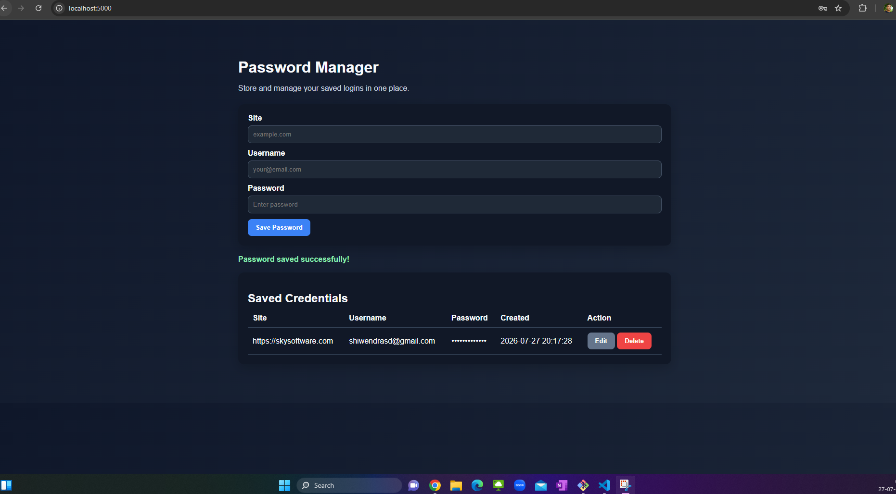

# Password Manager

A simple Flask-based password manager web application that lets you store, view, edit, and delete saved credentials for different websites.

## Features

- Add new site credentials with site, username, and password
- View all saved credentials in a table
- Edit existing entries
- Delete saved entries
- Simple form validation for required fields
- REST API endpoints for managing passwords

## Project Structure

- app.py - Main Flask application with API routes and in-memory storage
- templates/index.html - Web page layout for the password manager UI
- static/style.css - Styling for the app interface
- static/app.js - Frontend logic for fetching and updating data from the API
- tests/test_app.py - Basic unit tests for the update endpoint

## Requirements

- Python 3.8+
- Flask 3.0+

Install dependencies:

```bash
pip install -r requirements.txt
```

## How to Run

1. Open the project folder
2. Run the Flask app:

```bash
python app.py
```

3. Open your browser and go to:

```text
http://localhost:5000
```

## Screenshots



## API Endpoints

### Get all passwords

```http
GET /api/passwords
```

### Add a password

```http
POST /api/passwords
```

Request body:

```json
{
  "site": "example.com",
  "username": "user@example.com",
  "password": "secret123"
}
```

### Update a password

```http
PUT /api/passwords/<password_id>
```

### Delete a password

```http
DELETE /api/passwords/<password_id>
```

## Testing

Run the test suite with:

```bash
python -m unittest discover -s tests
```

## Notes

- This app stores passwords in memory while the server is running.
- Data will be lost when the Flask server restarts.
- The app runs in debug mode by default during development.
